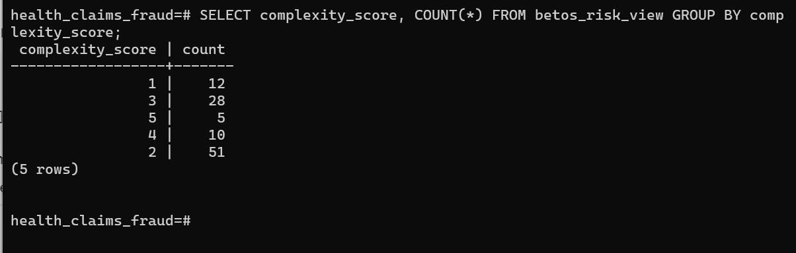
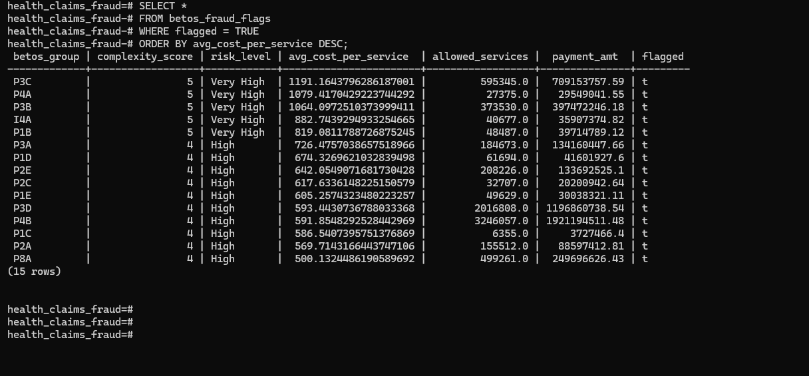
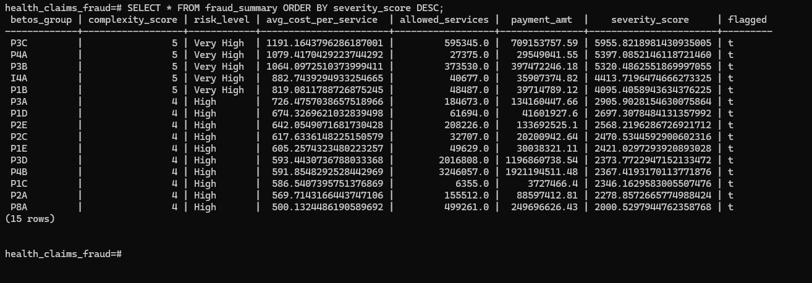

# BETOS-based complexity scoring Model | A System-level Fraud Analytics Platform
This scoring model is built using Medicare Part B National Summary data to identify high-risk service categories. BETOS-level cost-per-service metrics were derived and Actuarial thresholding applied to assign complexity scores. High-complexity categories were flagged and ranked using a severity score to prioritize fraud risk. The building of this model involved:
- Clean data ingestion
- Risk modeling 
- Explainable thresholds
- Fraud flags
- Severity ranking

The model can be used by: 
- CMS
- Insurers
- Policy audits

## Data Sources

Medicare Part B National Summary Data (CY 2024)
Source: CMS (https://catalog.data.gov/dataset/medicare-physician-other-practitioners-by-provider-and-service-b156e/resource/c96c16c3-a4f6-46a9-80cc-16a0bc803153)

Due to size constraints, raw datasets are not included in this repository.
Download the dataset and place it in the `/data` directory before running ingestion.

Created a virtual environment before the installation of packages to ingest medicare data: python -m venv venv (to create): source venv/Scripts/activate (to activate it).

Install the packages: pip install pandas sqlalchemy psycopg2-binary openpyxl

## Data Ingestion and Analysis
Ingested both the Medicare Part B data and the BETOS reference table in Python and are now in PostgreSQL. Therefore, we have
- Medicare claims data
- BETOS reference data  

The **logic** is to find a way to distinguish between simple claims and those which are complex/risky - what we call the **fraud risk lens**.  
BETOS gives categories which must be converted to risk (which carries some meaning)

### STEP 1: Create a BETOS (Complexity Mapping)
BETOS codes such as D1A, D1E, I1, etc do not identify "high risk" or "low risk" by themselves. We, therefore, have to analyze and decide which BETOS groups are complex, which cost more and which are more likely to be abused. This is **domain logic** not code logic. 

#### Creation of the complexity table
In standard actuarial or CMS thinking, we need this table to store our judgement. We will then convert **Category** -> **Score** -> **Risk label**. We will create the table in psql by running this code: 

Connect to the database in psql shell: \c health_claims_fraud  
Check the tables existing in the database: \dt

Create the needed tables: 

CREATE TABLE betos_complexity (
    betos_group VARCHAR(50) PRIMARY KEY,
    complexity_score INT,
    risk_level VARCHAR(20)
);

CREATE TABLE public.betos_metrics (
    betos_group VARCHAR(50) PRIMARY KEY,
    allowed_services NUMERIC,
    allowed_charges NUMERIC,
    payment_amt NUMERIC
);

CREATE TABLE betos_codes (
  betos_group VARCHAR(50) PRIMARY KEY,
  allowed_services NUMERIC,
  allowed_charges NUMERIC,
  payment_amt NUMERIC
);

## Analytics/Fraud Detection
### Map CPT codes to BETOS and assign complexity scores
Since the BETOS table is already ingested, the next step is to join the claims with BETOS and assign complexity score. This is what gives a "fraud risk lens" on the claims. 

#### Insert complexity logic
First check the BETOS groups that exist in the table with;  
SELECT DISTINCT betos_group FROM betos_codes;

Using **Actuarial** logic and deriving from betos_metrics, we now define the complexity score + risk level per BETOS group to get **betos_complexity**. 

#### What might make a BETOS group "complex"?
We use the following indicators from betos_metrics to answer this. 

| Metric            |  Use  |   |   |   |
|---|---|---|---|---|
|  allowed_services |  Volume of services: low volume may indicate specialized procedures|   |   |   |
|  allowed_charges |  Total charges submitted: higher charges - higher complexity  |   |   |   |
|  payment_amt | What Medicare actually paid: can indicate high-cost procedures   |  |   |   |

### Logic for complexity scoring
- Low complexity - low charges, high volume
- Medium complexity - moderate charges or specialized services
- High complexity - high charges, low volume, major procedures
- Very high - exceptionally high charges, major procedures

Getting complexity_score requires a risk modeling decision and we, therefore, define it using the data and domain logic. We do not rely on CMS knowldge as this fails to tell if it is "low risk" or "high complexity". CMS fails to answer this because complexity depends on use case and Fraud risk does not equal clinical complexity. Applying Actuarial logic solves this because of the possibility to define risk thresholds. 

While seeking a solution for the complexity_score, the worry as an insurer would come from;
1. High dollar amounts
2. Specialized / invasive procedures
3. Low volume but high payment
4. Historically abused categories

### Derivation of complexity_score
We use the betos_metrics available from the ingested data. 

1. Compute cost per service

SELECT
  betos_group,
  allowed_services,
  payment_amt,
  payment_amt / allowed_services AS avg_cost_per_service
FROM betos_metrics
ORDER BY avg_cost_per_service DESC; 

In the querry above; avg_cost_per_service = payment_amt / allowed_services tells how expensive on average one service is expensive in the BETOS group. 

Running the above query in psql gives the BETOS groups that are expensive **per service** and which ones are cheap but frequent. It therefore becomes the bridge between raw data and complexity. 

BETOS payment and service volume are used to calculate average cost per service, ranked service groups, and assigned complexity scores based on actuarial risk thresholds.

2. Ranking of BETOS groups: Definition of Clear, defendable thresholds
This is a key modeling step that involves a definition of bins. Based on the distribution from the querry above, we can have the following thresholds;

| Avg Cost per Service            |  Complexity Score |  Risk Level |   |   |
|---|---|---|---|---|
|  ≥ 800 |  5 | Very High  |   |   |
|  500 - 799 |  4 |  High |   |   |
|  100 - 499 | 3   | Medium |   |   |
|  10 - 99 |  2 |  Low |   |   |
|  < 10 | 1  | Very Low |   |   |

3. Automatic generation of complexity scores
Populate betos_complexity directly from betos_metrics by running the following SQL querry. 

INSERT INTO betos_complexity (betos_group, complexity_score, risk_level)  
SELECT betos_group,
  CASE  
    WHEN payment_amt / allowed_services >= 800 THEN 5
    WHEN payment_amt / allowed_services >= 500 THEN 4
    WHEN payment_amt / allowed_services >= 100 THEN 3
    WHEN payment_amt / allowed_services >= 10 THEN 2
    ELSE 1
  END AS complexity_score,
  CASE
    WHEN payment_amt / allowed_services >= 800 THEN 'Very High'
    WHEN payment_amt / allowed_services >= 500 THEN 'High'
    WHEN payment_amt / allowed_services >= 100 THEN 'Medium'
    WHEN payment_amt / allowed_services >= 10 THEN 'Low'
    ELSE 'Very Low'
  END AS risk_level
FROM betos_metrics;

4. Verify the complexity table
SELECT *
FROM betos_complexity
ORDER BY complexity_score DESC, betos_group;

5. Create the CPT-level complexity view
The creation of CPT-level complexity view is only possible now since the available data is National Summary data. True CPT-level analysis requires Medicare Provider and Service dataset and CPT -> BETOS crosswalk file. We can therefore for now join the betos_metrics to betos_complexity. 

Step 1 - Create BETOS risk view      

CREATE VIEW betos_risk_view AS  
SELECT 
  bm.betos_group,  
  bm.allowed_services,  
  bm.allowed_charges,  
  bm.payment_amt,  
  (bm.payment_amt / bm.allowed_services) AS avg_cost_per_service,
  bc.complexity_score,  
  bc.risk_level  
FROM betos_metrics bm 
JOIN betos_complexity bc 
  ON bm.betos_group = bc.betos_group;  

Step 2 - Validate  
 
 SELECT *  
 FROM betos_risk_view  
 ORDER BY complexity_score DESC, avg_cost_per_service DESC  
 LIMIT 10;

Step 3 - Identify high-risk service categories  
The identification of high-risk service categories helps us to know the types of services that are most prone to abuse.  

SELECT *  
FROM betos_risk_view  
WHERE complexity_score >= 4  
ORDER BY avg_cost_per_service DESC;  

### Create betos_risk_view

SELECT complexity_score, COUNT(*) FROM betos_risk_view GROUP BY complexity_score;

### Interpretation of betos_risk_view
| Complexity            |  Count  |   |   |   |
|---|---|---|---|---|
|  1 (Very Low) |  12 |   |   |   |
|  2 (Low) |  51  |   |   |   |
|  3 (Medium) | 28   |  |   |   |
|  4 (High) |  10  |   |   |   |
|  5 (Very High) | 5   |  |   |   |

The distribution above is healthy and represents what is expected for fraud models which confirms the sensibility of the thresholds used. This is what acts as a risk lens.
- Majority are low / medium - expected
- Small tail of high and very high - risk concentration

From the betos_risk_view above, we have a risk lens but no decision. We need to know what BETOS groups should to be investigated and therefore we need to create an explicit Fraud Flag. 

### Create a fraud flag rule - a fraud indicator view
- complexity_score >= 4 --> suspicious.

CREATE VIEW betos_fraud_flags AS  
SELECT  
  betos_group,  
  complexity_score,  
  risk_level,  
  avg_cost_per_service,  
  allowed_services,  
  payment_amt,  
  CASE  
  WHEN complexity_score >= 4 THEN TRUE  
  ELSE FALSE  
  END AS flagged  
  FROM betos_risk_view;

### Validate 
SELECT *
FROM betos_fraud_flags
WHERE flagged = TRUE
ORDER BY avg_cost_per_service DESC;

### The high-risk service categories are as follows

### Add Fraud Severity
Since not all items flagged are equally bad, we need to know how bad each one is. We therefore define severity score as below:

Severity = complexity * cost per service 

CREATE VIEW betos_fraud_severity AS  
SELECT  
  betos_group,  
  complexity_score,  
  risk_level,  
  avg_cost_per_service,  
  allowed_services,  
  payment_amt,  
  (complexity_score * avg_cost_per_service) AS severity_score  
  FROM betos_risk_view  
  WHERE complexity_score >= 4;

### Rank severity
Ranking severity lets us know:
- Which services cost the system most
- Which deserve audit priority

SELECT *
FROM betos_fraud_severity
ORDER BY severity_score DESC;

### Persist results
Views are fine, but fraud systems store results

CREATE TABLE fraud_summary (
  betos_group VARCHAR(10),
  complexity_score INT,
  risk_level VARCHAR(20),
  avg_cost_per_service NUMERIC,
  allowed_services NUMERIC,
  payment_amt NUMERIC,
  severity_score NUMERIC,
  flagged BOOLEAN
);

Insert data

INSERT INTO fraud_summary
SELECT
  betos_group,
  complexity_score,
  risk_level,
  avg_cost_per_service,
  allowed_services,
  payment_amt,
  complexity_score * avg_cost_per_service AS severity_score,
  TRUE
FROM betos_risk_view
WHERE complexity_score >= 4;

Validate  
SELECT * FROM fraud_summary ORDER BY severity_score DESC;

# Visual Dashboard
We now build a dashboard that provide visuals that help in answering the following questions:
1. Which **BETOS groups are highest risk**?
2. Which **CPT codes** are linked to high complexity?
3. Which **providers** overuse high-risk services?
4. Where are **outliers** (high cost, high frequency)? 

## Installation of the required dashboard packages
pip install streamlit pandas psycopg2-binary matplotlib seaborn

**Streamlit**: An open-source framework that allows you to quickly turn data scripts into interactive web applications and dashboards using only Python.

**Pandas**: The standard tool for data manipulation and analysis; it provides high-performance data structures like "DataFrames" for handling tabular, labeled data (similar to Excel or SQL tables).

**Psycopg2-binary**: A PostgreSQL database adapter for Python; the "binary" version is a pre-compiled package that allows you to connect to and query PostgreSQL databases without needing to install complex C-dependencies manually.

**Matplotlib**: A comprehensive library for creating static, animated, and interactive visualizations; it serves as the foundational plotting engine for many other Python tools.

**Seaborn**: A high-level statistical data visualization library built on top of Matplotlib; it provides a more user-friendly interface for drawing attractive and informative statistical graphics. 

